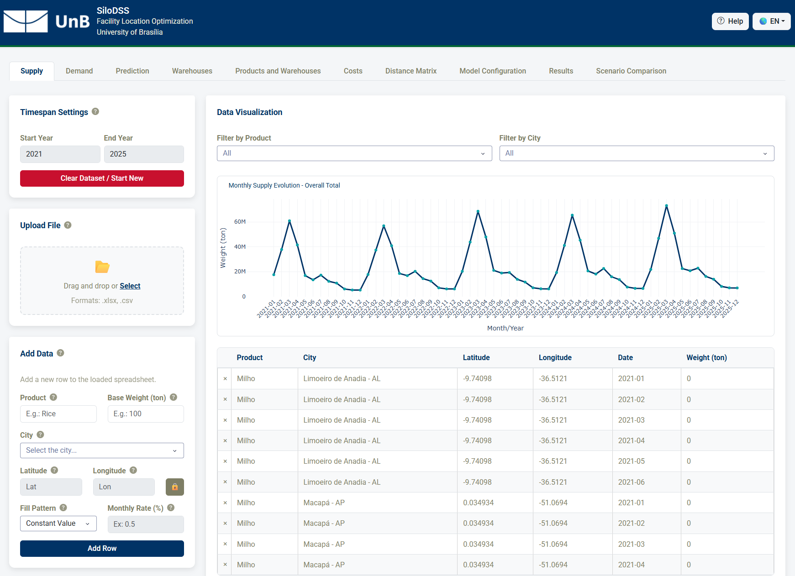

# SiloDSS
**A Decision Support System for Grain Hub Location Optimization using Deterministic and Stochastic Programming**

[](https://www.python.org/downloads/)
[](LICENSE)
[](#technical-stack)
[](#running-tests)

<p align="center">
  
</p>

---

## Overview

**SiloDSS** is an open-source, bilingual (English/Portuguese) Decision Support System (DSS) designed to optimize grain hub location, storage capacity investments, and multi-period distribution networks under uncertainty. The system minimizes total logistics expenditure—including road freight, inventory holding, transshipment handling, candidate facility opening, static capacity expansion, and bulkification retrofitting—using Mixed-Integer Linear Programming (MILP) models.

Integrating real road network distance calculation via the Open Source Routing Machine (OSRM), time-series predictive forecasting, and automated stochastic value post-processing (EVPI and decomposed VSS), SiloDSS provides planners and policymakers with an auditable, reproducible tool for evaluating agribusiness storage infrastructure and operational recourse strategies.

---

## Key Features

* **Dual Solver Support (CBC & Gurobi)**: Natively configured with the open-source COIN-OR CBC solver for zero-setup execution, alongside seamless integration with the commercial/academic Gurobi solver featuring in-browser `.lic` license file upload and session-isolated execution.
* **Deterministic & Two-Stage Stochastic Optimization**: Support standard single-scenario deterministic planning or hedge strategic investments against harvest and demand volatility across discrete scenarios (Pessimistic, Expected, Optimistic).
* **Automated Stochastic Value Metrics**: Computes the Expected Value of Perfect Information (**EVPI**) and the Value of the Stochastic Solution (**VSS**), including **VSS decomposition** (investment, operational, and Big-M penalty components) to prevent artificial feasibility penalties from distorting economic assessment.
* **Forecasting & Predictive Modeling**: Forecast future monthly supply and demand series using statistical (**SARIMA**, **Prophet**) or machine learning/deep learning (**XGBoost**, **PyTorch LSTM**) models, validated by WMAPE, RMSE, MAE metrics, and residual diagnostics.
* **OSRM Road Network Routing**: Automated calculation of highway distances and travel times across Brazilian road corridors, with dynamic fallback to Haversine geodesic calculations.
* **Multi-Corridor Network Topology**: Models multi-period flows across supply origins, intermediate storage hubs, domestic customers, and export ports, with configurable interhub cost factors (\(\alpha\)) and optional direct origin-to-customer bypass routes.
* **Infrastructure Upgrading**: Evaluates strategic candidate warehouse opening, physical static capacity expansion, and bulkification retrofitting (modernizing facilities to increase daily reception and shipping throughput without expanding static storage).
* **Interactive Dashboard & Bilingual i18n**: Built with Plotly Dash and Bootstrap Components following an 8pt layout grid, with full runtime language switching between English and Brazilian Portuguese.

---

## Technical Stack

* **Language**: Python >= 3.10, < 3.13 (Python 3.12 recommended)
* **Optimization Framework**: [Pyomo](https://pyomo.readthedocs.io/) (Mixed-Integer Linear Programming)
* **Solvers**: [COIN-OR CBC](https://github.com/coin-or/Cbc) (default, bundled in Docker) and [Gurobi](https://www.gurobi.com/) (via `gurobipy`)
* **Routing**: [Open Source Routing Machine (OSRM)](https://github.com/Project-OSRM/osrm-backend), Requests
* **Frontend/UI**: Dash, Plotly, Dash Bootstrap Components
* **Data Ingestion & Processing**: Pandas, OpenPyXL
* **Forecasting**: Statsmodels (SARIMA), Prophet, XGBoost, PyTorch (LSTM), Scikit-Learn

---

## Getting Started

### Prerequisites

* **Git**: To clone the repository.
* **Python**: Version 3.10 to 3.12 (Python 3.12 recommended).
* **Docker Desktop**: Required to run the OSRM routing engine (and optional containerized web application).

---

### 1. Docker Setup (Recommended)

Docker automatically manages both the SiloDSS web application and the local OSRM routing server.

1. **Clone the Repository**:
   ```bash
   git clone https://github.com/arturguerra921/silodss.git
   cd silodss
   ```

2. **Generate OSRM Map Data (One-Time Setup)**:
   This downloads and processes the latest map of Brazil (approx. 400-500 MB) for OSRM. Ensure Docker is running.
   ```bash
   python scripts/setup_osrm.py
   ```
   *Note: This can take 20-60 minutes depending on your computer's performance.*

3. **Launch all Services**:
   ```bash
   docker-compose up -d --build
   ```

4. **Access the App**:
   Navigate to **http://localhost:8050** in your browser.

---

### 2. Local Development Setup

For faster development iterations, run the Dash server locally while keeping the OSRM routing service running inside Docker.

1. **Start OSRM Service**:
   ```bash
   docker-compose up -d osrm
   ```

2. **Create and Activate Virtual Environment**:
   ```bash
   python -m venv venv
   # Windows:
   venv\Scripts\activate
   # macOS/Linux:
   source venv/bin/activate
   ```

3. **Install Dependencies**:
   ```bash
   pip install -e .
   ```

4. **Run Server**:
   ```bash
   python run_server.py
   ```
   The local application will be available at **http://localhost:8050**.

---

## Dashboard Tab-by-Tab Workflow

SiloDSS organizes the planning workflow into 10 structured steps represented as tabs in the user interface.

---

### 1. Oferta (Supply)
Configure the planning horizon and enter multi-year monthly supply datasets for agricultural products.
* **Timespan Configuration**: Define custom session-wide start and end years (e.g., 2021 to 2026). This locks once data is loaded to maintain temporal consistency across all tabs.
* **Import & Auto-detection**: Import Excel/CSV files. The system automatically detects the start/end range and adjusts the configuration.
* **Manual Entry & Patterns**: Manually insert series per product-city combination using either **Constant Value** or **Linear Growth/Decline** patterns.
* **Data Inspection**: View the monthly supply trends through interactive Plotly charts and modify/delete specific entries in the editable DataTable.

---

### 2. Demanda (Demand)
Manage destination/client consumption requirements across the same temporal horizon.
* **Horizon Inheritance**: Automatically inherits the start and end years locked in the *Oferta* tab.
* **Manual & File Input**: Add monthly demand series for product-destination combinations via file upload or manual forms.
* **Filtering & Trends**: Cross-filter by product and city, visualize monthly trends, and edit or delete records inline.

---

### 3. Previsão (Prediction)
Run forecasting models on historical supply and demand series to predict future values.
* **Algorithm Selection**: Choose between statistical models (**SARIMA**, **Prophet**) or machine learning/deep learning models (**XGBoost**, **PyTorch LSTM**).
* **Validation Parameters**: Set the test split size (months) to calculate accuracy metrics and choose the future prediction horizon.
* **Accuracy KPIs**: View quality metrics including **WMAPE (%)** (Weighted Mean Absolute Percentage Error), **RMSE**, and **MAE**, alongside a qualitative rating indicator (Excellent, Good, Regular, Bad).
* **Diagnostics**: Analyze forecast charts alongside residuals time-series and histogram plots to verify model fit.

---

### 4. Armazéns (Warehouses)
Manage the storage network, specifying existing assets and candidate hubs.
* **Warehouse Types**: Classify structures (e.g., Silo, Graneleiro, Convencional) and status (Existente / Candidato).
* **Location Mapping**: Select the municipality; the system resolves coordinates automatically, allowing manual overrides when needed.
* **Capabilities & Limits**: Specify static capacity, daily reception/shipping limits, and dynamic capacity multipliers.
* **Upgrades & Costs**: Define maximum expansion capacity, fixed/variable expansion costs, bulkification capabilities/costs, and opening investment costs for candidates.

---

### 5. Produto e Armazéns (Product & Warehouses)
Establish compatibility rules between agricultural products and storage structures.
* **Bespoke Matrix**: Map products to compatible warehouse types (e.g., specifying if Soy can be stored in a Conventional warehouse vs. a Silo).
* **Policy Enforcement**: Incompatible combinations are automatically excluded from the optimization flow.

---

### 6. Custos (Costs)
Define the financial tariffs driving the optimization objective.
* **Storage Tariffs**: Edit monthly storage costs per ton for each product. Includes a mandatory "Outros" fallback row for unlisted items.
* **Freight Rates**: Configure transportation costs per state (R$/ton-km) in an editable table.
* **Spreadsheet Utility**: Supports bulk template downloads and CSV/Excel uploads for quick setup.

---

### 7. Matriz de Distâncias (Distance Matrix)
Calculate the spatial routing matrix representing the physical logistics network.
* **Segment Breakdown**: Computes road distances for network corridors: Supply to Warehouses, Warehouses to Demand, Warehouses to Warehouses (interhub), and optional Direct Arcs (Supply to Demand).
* **Routing Engine**: Leverages OSRM for real highway distance and time calculations.
* **Fallback Mode**: Automatically detects failed queries and falls back to geodesic (Haversine with 1.3 road winding penalty) calculations, highlighted on the map as straight red lines.
* **Map & Detail**: Click on any cell in the generated distance table to visualize the exact route on the interactive Plotly map.

---

### 8. Configuração do Modelo (Model Configuration)
Fine-tune constraints and specify the mathematical optimization behavior.
* **Model Type**: Select between **Deterministic** (nominal expected values) and **Two-Stage Stochastic** (multi-scenario risk hedging).
* **Solver Selection**: Choose between **COIN-OR CBC** and **Gurobi**. Users can upload custom `.lic` license files directly through the interface for session-persistent Gurobi execution.
* **Stochastic Probability & Errors**: Assign probability weights to Pessimistic, Expected, and Optimistic scenarios, and choose to derive perturbation errors from forecasting WMAPEs or manual percentages.
* **General Constants**: Configure operational days per period, interhub factor (\(\alpha\)), solver gap limit, and solver timeout.
* **Physical Extensions & Bulkification**: Toggle whether the model can dynamically decide to expand capacity or bulkify warehouses, respecting custom limits and costs.
* **Pareto Route Filtering**: Optional heuristic filter to retain only the top 20% shortest routes per origin to accelerate solver speed on large networks.

---

### 9. Resultados (Results)
Execute the optimization solver and analyze the resulting logistics network.
* **Global KPIs**: View total optimal cost, tons moved, total distance traveled, freight cost, storage cost, opening cost, expansion cost, and bulkification cost.
* **Decision Highlights**: Count opened candidates, expansions, bulkifications, and total infrastructure investments.
* **Details & Export**: Review the interactive warehouse performance table (turnover ratios, dynamic capacity, outflows, ending stocks) and download detailed Excel reports (`.xlsx`).
* **Network Flow Map**: Inspect the optimal routing decisions on the interactive flow map with filters by route corridor.

---

### 10. Comparação de Cenários (Scenario Comparison)
Available only after executing a Stochastic optimization run.
* **Stochastic Value Analysis**: Calculates **EVPI** (Expected Value of Perfect Information) and **VSS** (Value of Stochastic Solution), complete with **VSS decomposition** into investment, operational, and Big-M penalty components to isolate true hedging benefits from artificial penalty values.
* **Scenario Performance**: Compare KPIs side-by-side across Pessimistic, Expected, and Optimistic scenarios.
* **Visual Breakdown**: Grouped bar charts illustrate cost components per scenario, line charts plot aggregated warehouse inventory evolution over time, and geographic maps visualize warehouse metrics (capacity utilization, outflows, final stocks, turnover).

---

## Mathematical Formulations

The complete mathematical formulations for both the deterministic and two-stage stochastic Mixed-Integer Linear Programming (MILP) models—including index sets, decision variables, capacity limits, flow balances, bulkification and expansion constraints, and recourse rules—are implemented in:

* **[`src/logic/optimization.py`](src/logic/optimization.py)**: Contains the Pyomo model construction routines (`build_deterministic_pyomo_model`, `build_stochastic_pyomo_model`), execution runners (`run_deterministic_model`, `run_stochastic_model`), and post-solve calculation routines for dynamic capacity, turnover, EVPI, and VSS decomposition.

---

## Running Tests

To run the backend test suite and verify optimization, forecasting, and data-parsing logic:
```bash
python -m unittest discover tests
```

---

## Project Structure

```
silodss/
├── docker-compose.yml       # Docker services configuration
├── Dockerfile               # Web application container definition
├── pyproject.toml           # Package metadata and dependencies
├── run_server.py            # Local execution script
├── wsgi.py                  # Gunicorn entry point
├── tests/                   # Backend unit tests
├── benchmark/               # Benchmark scripts, configs, and sample datasets
├── scripts/                 # Setup and benchmarking utilities (setup_osrm.py)
└── src/
    ├── locales/             # i18n English/Portuguese translation files
    ├── logic/               # Optimization, OSRM, prediction, and utility logic
    └── view/                # Dash layouts, callbacks, themes, and page definitions
```
